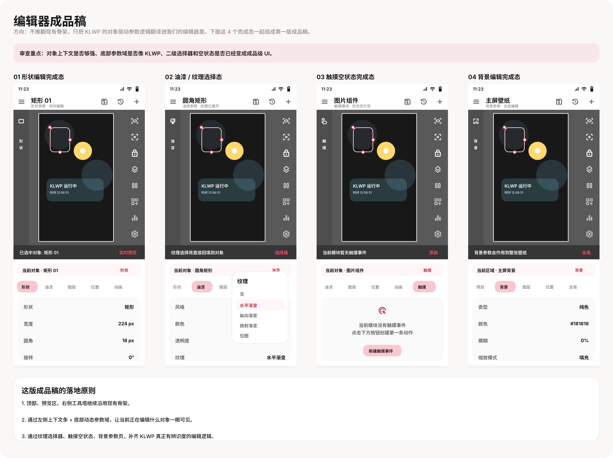
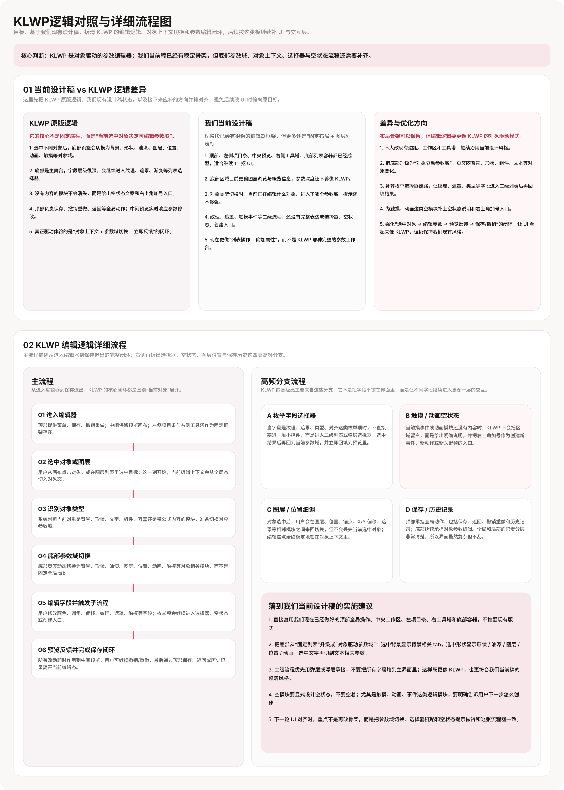
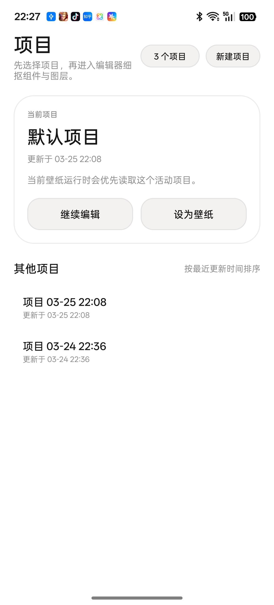
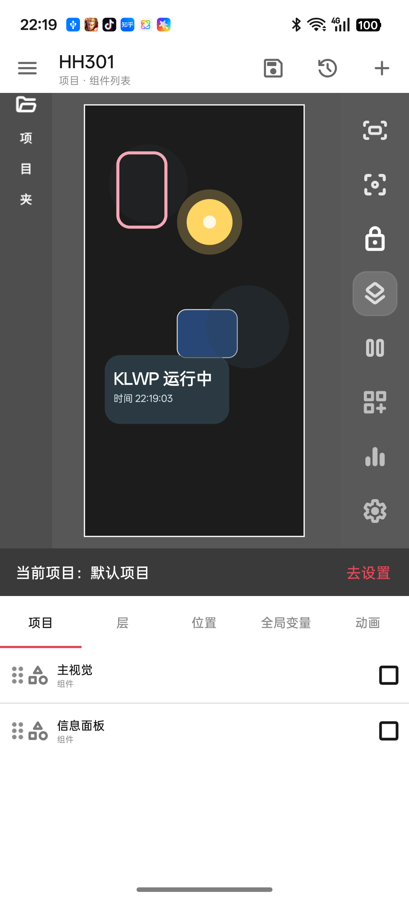

# Kuper Skins

一个基于 Android 原生 `WallpaperService + Canvas` 的 KLWP 编辑器复刻实验项目。

当前阶段的目标很明确：先把“项目首页 -> 编辑器预览 -> 壁纸运行时 -> 本地持久化 -> 系统设为动态壁纸”这条链路打通，再继续往更完整的编辑能力推进。

## 当前已完成

- `ProjectHomeActivity`
  - 中文项目首页
  - 当前项目卡片
  - 最近项目列表
  - 新建项目、继续编辑、设为壁纸入口
- `MainActivity`
  - 中文化编辑器页
  - 顶部工具栏、左侧项目条、右侧工具塔、底部图层区
  - 项目态与组件态切换
  - 图层选中、删除、可见性切换、基础属性调节
- `EditorRuntimePreviewView`
  - 编辑器内实时预览
  - 图层点击选中
  - 拖拽与基础变换联动
- `DemoWallpaperService`
  - 动态壁纸运行时入口
  - 从当前活动项目恢复壁纸文档
- `ProjectSessionManager`
  - 项目创建、切换、复制、重命名、删除
  - 活动项目持久化
  - 编辑器与壁纸运行时状态联动
- `WallpaperApplyHelper`
  - 首页与编辑器共用的“设为壁纸”跳转逻辑

## 设计稿与实机截图

### 编辑器成品稿



### 逻辑流程图



### 项目首页实机



### 编辑器实机



## 目录说明

- `app/src/main/java/com/example/klwpdemo/`
  - 应用主逻辑
- `app/src/main/res/`
  - 布局、颜色、图标与界面资源
- `docs/`
  - 设计分析、路线图与说明文档
- `docs/assets/`
  - README 中使用的设计稿与实机截图

## 本地构建

建议环境：

- Android Gradle Plugin `9.0.1`
- Gradle `9.2.1`
- Java `17+`
- Android SDK Platform `36`

常用命令：

```powershell
.\gradlew.bat assembleDebug
.\gradlew.bat installDebug
```

如需生成 release：

```powershell
.\gradlew.bat assembleRelease
```

## 使用流程

1. 打开应用，先进入项目首页。
2. 点击“继续编辑”进入编辑器。
3. 在编辑器里调整项目与组件内容。
4. 通过首页或编辑器底部的“设为壁纸/去设置”进入系统动态壁纸预览页。
5. 在系统页手动点一次“设为”，完成最终应用。

## 当前仓库保留内容

本仓库只保留以下内容：

- 可运行的 Android 源码
- 必要的资源文件
- 必要的设计分析文档
- 少量用于说明成果的设计稿和实机截图

调试过程中的临时输出与中间产物不再作为仓库内容维护。
