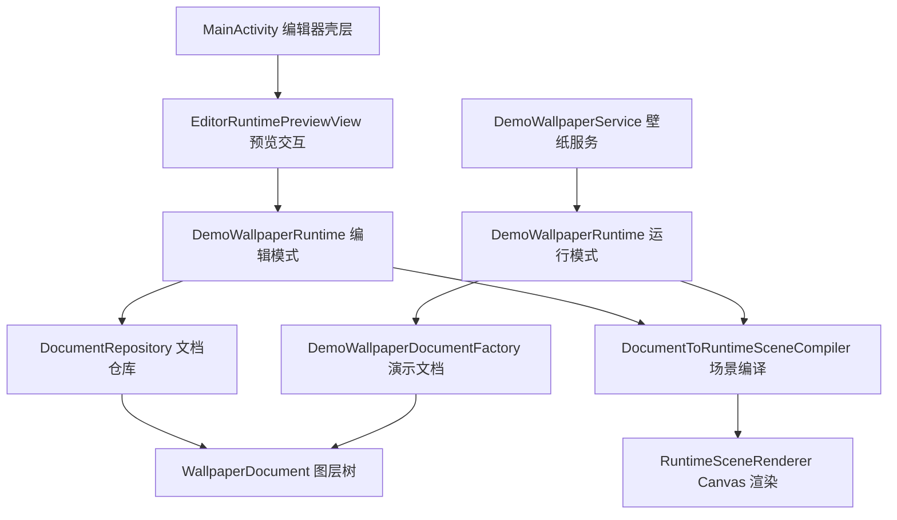

# KLWP 复刻项目架构差距分析与阶段路线图

## 1. 文档目标

这份文档的目标不是再写一份泛泛的愿景，而是基于当前仓库里的真实代码，回答四个问题：

1. 我们现在到底已经做到了什么。
2. 这些能力可以直接复用到哪些界面和流程。
3. 和真正可用的 KLWP 式产品相比，还差哪些关键层。
4. 每一条后续工作是否可行，应该先做什么，风险在哪里。

当前判断很明确：

- 这套代码已经具备“编辑器原型”的骨架。
- 这套代码还不具备“真实项目系统”的骨架。
- 真正的第一优先级不应该再继续堆单点 UI，而是先把“项目作为核心对象”的数据底座补齐。

---

## 2. 当前实现盘点

## 2.1 已完成的真实能力

结合当前代码，已经完成的内容可以归纳为 5 层。

### A. 文档模型层

对应文件：

- `app/src/main/java/com/example/klwpdemo/document/WallpaperDocument.kt`

已实现：

- `WallpaperDocument` 作为编辑器和运行时共用的根文档。
- `BackgroundDocument` 支持纯色和线性渐变。
- `LayerDocument` 统一抽象图层。
- 图层类型已经有：
  - `GroupLayerDocument`
  - `ShapeLayerDocument`
  - `ImageLayerDocument`
  - `TextLayerDocument`
- `LayerTransformDocument` 已支持：
  - 平移
  - 缩放
  - 旋转
  - 透明度
- 形状样式已经支持：
  - 填充色
  - 描边色
  - 描边宽度
  - 圆角

结论：

- 数据模型已经从“纯界面拼装”走到了“可被编译和渲染的文档结构”。
- 但它本质上仍然是“通用图层树”，还不是“项目 -> 组件 -> 子项”的正式领域模型。

### B. 编辑命令层

对应文件：

- `app/src/main/java/com/example/klwpdemo/editor/DocumentEditing.kt`

已实现：

- `DocumentRepository` 负责持有当前文档。
- 已有撤销栈、重做栈。
- 已有命令合并能力，适合拖拽这类高频操作。
- 已有命令类型：
  - 新增形状
  - 删除图层
  - 更新图层变换
  - 更新显隐状态
  - 更新形状样式

结论：

- 编辑器不是直接改 View 状态，而是在改文档快照，这条路线是对的。
- 这意味着后续做保存、导出、历史回放、自动保存都具备基础。

### C. 运行时与编译层

对应文件：

- `app/src/main/java/com/example/klwpdemo/runtime/DemoWallpaperRuntime.kt`
- `app/src/main/java/com/example/klwpdemo/compiler/DocumentToRuntimeSceneCompiler.kt`
- `app/src/main/java/com/example/klwpdemo/runtime/RuntimeScene.kt`
- `app/src/main/java/com/example/klwpdemo/runtime/RuntimeSceneRenderer.kt`

已实现：

- 文档可以被编译为 `RuntimeScene`。
- 运行时节点与文档节点已经解耦。
- `RuntimeSceneRenderer` 已能渲染：
  - 背景
  - 组
  - 形状
  - 图片
  - 文本
- 已有运行时动态输入：
  - 视口尺寸
  - 壁纸偏移
  - 触摸采样
  - 涟漪进度
  - 电量状态
  - 当前时间

结论：

- “文档 -> 运行时场景 -> Canvas 渲染”这条链已经通了。
- 这是整个项目最值钱的底层资产，可以复用到编辑预览、壁纸预览、项目缩略图、导出图等多个地方。

### D. 编辑器预览交互层

对应文件：

- `app/src/main/java/com/example/klwpdemo/EditorRuntimePreviewView.kt`

已实现：

- 独立编辑器预览运行时。
- 点击命中选中图层。
- 拖拽移动图层。
- 简单缩放手势。
- 删除选中图层。
- 更新选中形状填充色。
- 编辑快照回传给页面。

结论：

- 现在已经不是静态假图，而是真正可编辑的预览面板。
- 这意味着我们后续不需要重写编辑器预览，只需要在现有预览上扩展交互能力。

### E. Android 壁纸接入层

对应文件：

- `app/src/main/java/com/example/klwpdemo/DemoWallpaperService.kt`

已实现：

- `WallpaperService.Engine` 已接通。
- 已响应：
  - 可见性变化
  - Surface 尺寸变化
  - 桌面偏移
  - 触摸输入
- 已能实际锁定 `Canvas` 进行绘制。
- 已实现壁纸主色上报。

结论：

- 这不是普通演示页，而是已经能跑到真实动态壁纸入口的代码。
- 从“原型 App”走向“真正壁纸产品”的最关键系统接入口已经具备。

---

## 2.2 当前最重要的架构事实

当前项目最关键的现实，不是“已经有很多 UI”，而是以下三个事实：

### 事实 1：编辑态和运行态共享一套文档模型

这是正确方向。

价值：

- 后续不需要维护两套逻辑。
- 编辑器所见与壁纸所见，天然更容易保持一致。
- 保存、导出、撤销、预览同步都更容易落地。

### 事实 2：当前的“项目 -> 组件 -> 子项”更多体现在演示数据和 UI 展示层

对应文件：

- `app/src/main/java/com/example/klwpdemo/document/DemoWallpaperDocumentFactory.kt`
- `app/src/main/java/com/example/klwpdemo/MainActivity.kt`

当前情况：

- 演示文档已经按 `project-*`、`component-*` 的方式组织。
- 编辑器底部列表也会把顶层 `Group` 识别为“项目”，下一层 `Group` 识别为“组件”。

但本质上：

- 文档模型里并没有正式的 `ProjectDocument`。
- 也没有正式的 `ComponentDocument`。
- 更没有项目元信息、资源清单、保存状态、缩略图、版本号等项目级字段。

结论：

- 我们现在是“看起来像项目逻辑”。
- 还不是“真正具备项目逻辑的数据架构”。

### 事实 3：非编辑态仍然由演示工厂在每帧生成文档

对应文件：

- `app/src/main/java/com/example/klwpdemo/runtime/DemoWallpaperRuntime.kt`
- `app/src/main/java/com/example/klwpdemo/document/DemoWallpaperDocumentFactory.kt`

当前情况：

- 编辑模式会优先使用 `DocumentRepository` 里的文档。
- 非编辑模式会在 `render()` 里继续调用 `DemoWallpaperDocumentFactory.createDocument(...)`。

这说明：

- 当前壁纸运行时的“真实数据源”还不是用户项目。
- 现在更像“演示场景播放器”，不是“项目驱动型壁纸引擎”。

结论：

- 这是当前整个项目最大的结构性短板。
- 如果不先改这里，后面越做越多 UI，返工成本会越来越高。

---

## 2.3 当前能力可直接复用到哪些界面

下表是“现有代码可以直接套到哪里”的判断。

| 现有能力 | 可直接复用界面/流程 | 复用价值 | 备注 |
| --- | --- | --- | --- |
| `WallpaperDocument` 文档模型 | 编辑器页、项目预览卡片、导出页 | 高 | 未来应扩展为正式项目模型 |
| `DocumentRepository` 历史栈 | 编辑器页、属性面板、批量编辑 | 高 | 做自动保存和操作历史都能接上 |
| `DocumentToRuntimeSceneCompiler` | 编辑预览、桌面壁纸、缩略图生成 | 高 | 当前最稳定的中间层 |
| `RuntimeSceneRenderer` | 编辑器预览、壁纸服务、导出位图 | 高 | 后续可继续做缓存优化 |
| `EditorRuntimePreviewView` | 编辑器第 1 屏、第 2 屏、属性联动 | 高 | 不建议推倒重写 |
| `DemoWallpaperService` | 真实桌面壁纸验证 | 高 | 但调度策略还需优化 |
| 当前项目/组件列表壳层 | 编辑器项目树页面 | 中 | 视觉已具备，数据能力还不完整 |
| 形状编辑链路 | 基础图层编辑 | 高 | 是当前最成熟的一条能力链 |

结论：

- 最适合继续复用和深化的是“编辑器页”和“真实壁纸预览链路”。
- 最不适合现在直接扩展的是“库页/探索页的复杂产品逻辑”，因为项目底座还没真正完成。

---

## 3. 当前架构图

### 当前架构优点

- 分层已经基本清晰。
- 编辑器与运行时存在共享底座。
- 预览不是假数据截图，而是真运行时。
- 未来可以把“项目持久化”和“表达式系统”插入到现有链路中。

### 当前架构问题

- 运行态和编辑态的数据源不统一。
- 没有正式项目仓库，没有真正的工程文件。
- 没有资源管理层，图片仍然是 `drawableResId` 思路。
- 没有表达式系统，当前动态只是演示工厂直接拼出来的结果。
- 没有 dirty 调度，壁纸服务还是固定帧率循环。

---

## 4. 与 KLWP 的核心差距

这里不从“像不像界面”出发，而从“是不是一个能长期使用的 KLWP 式产品”出发。

## 4.1 数据层差距

### 当前已有

- 图层树
- 基础样式
- 基础变换
- 简单分组

### 还缺什么

- 正式项目模型
- 项目元信息
- 工程文件持久化
- 资源引用与导入清单
- 文档版本与迁移
- 项目级缩略图
- 最近打开记录

### 影响

- 现在无法真正保存和恢复用户项目。
- 无法形成“项目列表 -> 打开项目 -> 编辑 -> 保存 -> 重新进入”的完整闭环。

## 4.2 编辑器能力差距

### 当前已有

- 选中
- 拖拽
- 缩放
- 显隐
- 删除
- 撤销重做
- 形状填充色编辑

### 还缺什么

- 图层重命名
- 图层复制
- 图层排序
- 图层锁定
- 宽高直接编辑
- 旋转编辑
- 圆角/描边编辑
- 文字专属编辑器
- 图片专属编辑器
- 进度条等组件编辑器
- 吸附线/参考线
- 多选与对齐
- 长按菜单
- 批量操作

### 影响

- 当前更像“可拖动演示编辑器”。
- 还不是“能长时间创作项目”的编辑器。

## 4.3 动态能力差距

### 当前已有

- 时间输入
- 电量输入
- 触摸输入
- 偏移输入
- 简单演示动画

### 还缺什么

- 全局变量系统
- 公式解析与求值
- 条件显示
- 条件文本
- 条件颜色
- 动画配置系统
- 用户交互动作链
- 数据驱动刷新

### 影响

- 当前动态效果是“代码里写死的演示逻辑”。
- 还不是“用户可配置的动态壁纸逻辑”。

## 4.4 产品壳层差距

### 当前已有

- 编辑器主页面原型

### 还缺什么

- 项目列表页
- 库页
- 探索页
- 模板与预设页
- 导入导出流程
- 项目备份与恢复
- 首次引导流程

### 影响

- 当前产品入口不完整。
- 即使编辑器已经能用，用户也无法自然管理多个项目。

## 4.5 工程与性能差距

### 当前已有

- 壁纸服务入口
- Canvas 渲染
- 基础 Drawable 缓存

### 还缺什么

- 项目缓存策略
- 缩略图缓存
- 资源清理
- dirty 渲染调度
- 后台保存
- 崩溃恢复
- 大项目性能分析
- 低端机降级策略

### 影响

- 目前可以跑 demo。
- 但还不够支撑“用户连续编辑 + 实机长时间壁纸运行”。

---

## 5. 分阶段路线图

这里建议把后续开发分成 4 个阶段，而不是所有内容一起推进。

## 5.1 阶段一：项目底座修正期

### 目标

把“演示编辑器”升级成“真正以项目为核心的数据架构”。

### 这一阶段必须完成的内容

1. 增加正式项目模型。
2. 增加项目持久化读写。
3. 让编辑态和运行态都基于同一个项目源。
4. 增加资源引用层，而不是只认 `drawableResId`。
5. 明确 schema 版本号和迁移入口。

### 推荐产出

- `ProjectDocument` 或等价项目实体
- `ProjectRepository`
- `*.json` 或 `*.kuper` 工程文件格式
- 项目列表页最小可用版
- 运行时从“加载项目”而不是“生成演示数据”

### 阶段结论

这是所有后续工作的地基。

如果这一阶段不做，后面做再多 UI 和交互都会越来越偏演示化。

## 5.2 阶段二：编辑器可用版

### 目标

让编辑器从“可演示”变成“可连续创作”。

### 这一阶段必须完成的内容

1. 图层重命名、复制、删除、排序、锁定。
2. 属性面板补齐：
   - 尺寸
   - 位置
   - 旋转
   - 透明度
   - 填充
   - 描边
   - 圆角
3. 文本图层编辑器。
4. 图片图层编辑器。
5. 图层树交互优化：
   - 展开收起
   - 长按菜单
   - 批量操作预留
6. 项目 -> 组件 -> 子项浏览逻辑稳定化。

### 推荐产出

- 编辑器 1.0 可用版
- 一套可稳定保存并恢复的项目样例
- 多个真实项目在手机上可打开可编辑

### 阶段结论

这是最接近用户可见价值的阶段，也是当前代码最容易延展成功的一段。

## 5.3 阶段三：KLWP 核心动态能力期

### 目标

把“固定视觉编辑器”升级成“可配置动态壁纸系统”。

### 这一阶段必须完成的内容

1. 全局变量系统。
2. 公式表达式系统。
3. 图层属性绑定系统。
4. 条件显示与条件样式。
5. 动画配置系统。
6. 事件驱动刷新与调度优化。

### 推荐产出

- 文本、颜色、透明度、位置等都可绑定变量或公式
- 基础动画编辑面板
- 真正由项目数据驱动的动态预览

### 阶段结论

这是“像不像 KLWP”的核心分水岭。

没有这一层，产品只是视觉编辑器；有了这一层，才开始接近 KLWP。

## 5.4 阶段四：产品壳与生态扩展期

### 目标

把“能做项目”升级成“能管理、分享、发现和复用项目”的完整产品。

### 这一阶段必须完成的内容

1. 项目列表正式版。
2. 库页与探索页。
3. 预设导入导出。
4. 模板体系。
5. 资源包与组件复用。
6. 更多系统数据源。

### 阶段结论

这是产品完成度阶段，不是当前最早的关键路径。

---

## 6. 逐项可行性分析

这一节按“做什么、为什么、能不能做、风险在哪”逐条判断。

## 6.1 项目持久化

- 内容：把当前文档保存为项目文件，并支持重新打开。
- 当前基础：已有不可变文档模型和仓库。
- 可行性：高。
- 原因：数据结构已经较清晰，最缺的是序列化协议和项目索引。
- 风险：中。
- 风险点：后面如果还要加变量、资源、版本迁移，早期文件结构要留扩展字段。
- 建议优先级：最高。

## 6.2 正式项目模型

- 内容：把“项目”从 UI 语义升级为正式领域对象。
- 当前基础：演示数据已具备项目/组件命名约定。
- 可行性：高。
- 原因：当前层级已经接近，只差从命名约定改成显式建模。
- 风险：中。
- 风险点：要决定是新增 `ProjectDocument`，还是继续用 `WallpaperDocument` 外包一层项目壳。
- 建议优先级：最高。

## 6.3 统一运行时数据源

- 内容：让壁纸服务和编辑器都加载同一个项目源，而不是一边用仓库，一边用演示工厂。
- 当前基础：编译器和渲染器已共享。
- 可行性：高。
- 原因：现有中间层已经足够好，只需要替换输入来源。
- 风险：中。
- 风险点：需要定义“项目加载失败时的回退策略”。
- 建议优先级：最高。

## 6.4 资源管理与图片导入

- 内容：支持项目引用外部图片资源，而不是只靠 `drawableResId`。
- 当前基础：已有 `ImageLayerDocument` 和图片渲染节点。
- 可行性：中高。
- 原因：渲染端已经支持图片，只差资源寻址、复制、压缩、清理。
- 风险：中。
- 风险点：权限、Uri 持久化、缓存体积、删除回收。
- 建议优先级：高。

## 6.5 图层树增强

- 内容：重命名、复制、排序、锁定、展开收起。
- 当前基础：已有图层树、命令仓库、底部列表 UI。
- 可行性：高。
- 原因：属于当前架构的自然延展。
- 风险：低到中。
- 风险点：排序和复制要保证嵌套层级不出错。
- 建议优先级：高。

## 6.6 形状编辑补齐

- 内容：补齐宽高、旋转、圆角、描边、透明度、位置的完整编辑。
- 当前基础：文档字段都在，预览也已支持部分联动。
- 可行性：高。
- 原因：主要是属性面板和命令扩展。
- 风险：低。
- 风险点：数值输入、滑杆输入、实时预览的一致性。
- 建议优先级：高。

## 6.7 文本图层编辑器

- 内容：新增文本创建、文本内容、字号、对齐、字重、颜色编辑。
- 当前基础：已有 `TextLayerDocument`、编译器和渲染器支持。
- 可行性：高。
- 原因：渲染层已经准备好了，主要缺 UI 和命令。
- 风险：低到中。
- 风险点：字体测量、基线、对齐感知在不同机型的表现。
- 建议优先级：高。

## 6.8 图片图层编辑器

- 内容：支持导入图片、替换图片、裁切与缩放。
- 当前基础：已有图片节点和渲染链。
- 可行性：中高。
- 原因：数据和渲染没问题，难点在资源与裁切交互。
- 风险：中。
- 风险点：大图内存、裁切矩阵、异步解码。
- 建议优先级：中高。

## 6.9 多选、对齐、吸附线

- 内容：做更专业的排版编辑能力。
- 当前基础：已有单选、拖拽和简单缩放。
- 可行性：中。
- 原因：可做，但会明显提高预览交互复杂度。
- 风险：中高。
- 风险点：命中逻辑、手势冲突、参考线算法、组选择。
- 建议优先级：中。

## 6.10 全局变量系统

- 内容：定义用户可编辑的全局变量，如颜色、数字、文本、开关。
- 当前基础：已有文档结构和运行时状态入口。
- 可行性：中高。
- 原因：变量系统本身不难，关键是要和属性绑定方式一起设计。
- 风险：中。
- 风险点：变量类型设计、默认值、引用失效。
- 建议优先级：高。

## 6.11 公式表达式系统

- 内容：支持文本、颜色、透明度、位置等属性通过表达式计算。
- 当前基础：当前运行时已有时间、电量、偏移、触摸等动态输入。
- 可行性：中。
- 原因：可以先做精简版表达式子集，不需要一开始就追平 KLWP 全量语法。
- 风险：高。
- 风险点：解析器、错误提示、性能、表达式安全边界。
- 建议优先级：高，但要放在项目底座稳定之后。

## 6.12 动画系统

- 内容：让图层属性可以按时间、状态或触发器变化。
- 当前基础：当前已有变换、透明度、运行时时间输入。
- 可行性：中。
- 原因：可以从基础补间动画做起。
- 风险：中高。
- 风险点：和表达式系统、变量系统、刷新调度强耦合。
- 建议优先级：中高。

## 6.13 条件显示与条件样式

- 内容：满足条件时显示、隐藏或切换样式。
- 当前基础：已有显隐字段、动态状态输入。
- 可行性：中高。
- 原因：比完整动画系统简单，适合成为表达式系统的早期落地点。
- 风险：中。
- 风险点：条件链过多时性能和调试体验。
- 建议优先级：高。

## 6.14 数据源扩展

- 内容：天气、通知、音乐、日历、系统状态等。
- 当前基础：当前只有时间、电量、触摸、偏移这类轻量输入。
- 可行性：中。
- 原因：按单个 Provider 分批做是可行的。
- 风险：中高。
- 风险点：权限、后台限制、厂商兼容、更新频率。
- 建议优先级：中。

## 6.15 库页、探索页、模板页

- 内容：完整产品壳层。
- 当前基础：已有部分设计方向，但底层项目体系未完整。
- 可行性：高。
- 原因：纯页面并不难。
- 风险：中。
- 风险点：如果项目体系没定，页面很容易先做成空壳。
- 建议优先级：中，晚于项目底座。

## 6.16 预设导入导出

- 内容：工程分享、备份、恢复。
- 当前基础：只要项目文件格式稳定，就能开始做。
- 可行性：中高。
- 原因：本质是项目持久化的外延功能。
- 风险：中。
- 风险点：资源路径、版本兼容、跨设备导入。
- 建议优先级：中高。

## 6.17 性能调度优化

- 内容：从固定帧循环转为 dirty 驱动渲染，提升功耗表现。
- 当前基础：运行时结构清晰，适合插入调度层。
- 可行性：中高。
- 原因：能做，但要先梳理哪些事件真正需要重绘。
- 风险：中。
- 风险点：动画、表达式和数据源接入后调度复杂度会明显增加。
- 建议优先级：高。

## 6.18 直接兼容 KLWP 预设

- 内容：直接导入 KLWP 原生预设格式。
- 当前基础：几乎没有。
- 可行性：低。
- 原因：KLWP 并非开放内部工程格式标准，且功能面很广。
- 风险：极高。
- 风险点：兼容面无法收敛，投入产出比极差。
- 建议优先级：不建议纳入当前阶段目标。

---

## 7. 推荐的真实开发顺序

基于当前代码状态，我建议按下面顺序推进，而不是继续无序扩展。

## 7.1 第一优先级

1. 正式项目模型。
2. 项目持久化。
3. 统一运行时数据源。
4. 资源管理层。

原因：

- 这是整个产品从“演示模式”切换到“项目模式”的核心。
- 不先做这个，后面任何 UI 和功能都缺真实落点。

## 7.2 第二优先级

1. 图层树增强。
2. 形状属性补齐。
3. 文本图层编辑器。
4. 图片图层编辑器。

原因：

- 这是用户最容易感知的可用性提升。
- 也是对当前已完成代码复用率最高的一段开发。

## 7.3 第三优先级

1. 全局变量系统。
2. 条件显示。
3. 公式表达式系统。
4. 基础动画系统。

原因：

- 这是“像不像 KLWP”的核心能力。
- 但这层建立在项目底座和可用编辑器之上，不能倒着做。

## 7.4 第四优先级

1. 库页。
2. 探索页。
3. 模板与预设市场。
4. 多 Provider 数据源。

原因：

- 这部分更偏产品完成度和生态。
- 不是当前主链卡点。

---

## 8. 每个阶段的验收标准

## 8.1 阶段一验收

- 可以创建项目。
- 可以保存项目。
- 可以重新打开项目。
- 壁纸服务加载的是用户项目，而不是演示工厂。
- 图片资源可以跟随项目一起保存和恢复。

## 8.2 阶段二验收

- 可以连续编辑多个项目而不崩。
- 图层可以增删改查和排序。
- 文字和图片都能创建与编辑。
- 编辑器退出重进后状态可恢复。
- 真机上编辑器预览和壁纸效果基本一致。

## 8.3 阶段三验收

- 图层属性可以绑定变量或公式。
- 至少支持一组基础条件显示。
- 至少支持一组基础动画。
- 动态预览和桌面壁纸表现一致。

## 8.4 阶段四验收

- 用户可以管理多个项目。
- 用户可以导入导出项目。
- 用户可以从模板或库页快速开始。
- 常用系统数据源可以被项目消费。

---

## 9. 最终结论

当前项目最值得肯定的地方，不是界面复刻得多像，而是底层主链已经具备了：

- 文档模型
- 编辑命令栈
- 运行时编译
- Canvas 渲染
- 壁纸服务接入

这说明项目并没有走偏，反而已经踩到了正确的工程路线。

但同样要非常清醒：

- 现在的主问题已经不是“再画一页 UI”。
- 现在的主问题是“项目底座还没有真正站稳”。

如果只继续抠单页 UI，项目会越来越像精致 demo。

如果先把“项目模型 + 保存恢复 + 统一运行时数据源 + 资源管理”做完，后面编辑器、动态能力、产品壳层都会顺很多。

因此当前最推荐的下一步只有一句话：

**先把项目系统做实，再扩编辑器能力，最后再补 KLWP 核心动态能力和产品壳层。**
