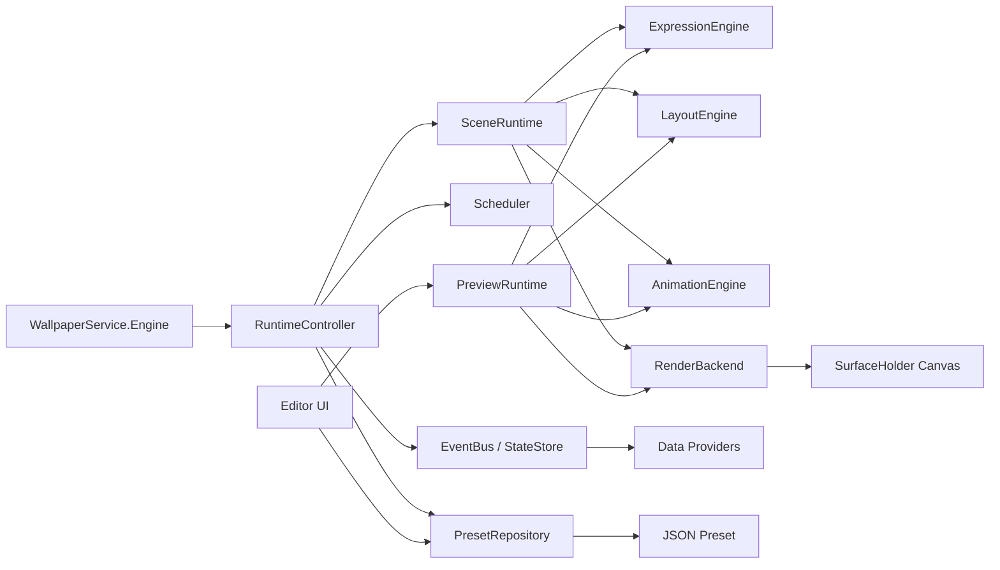
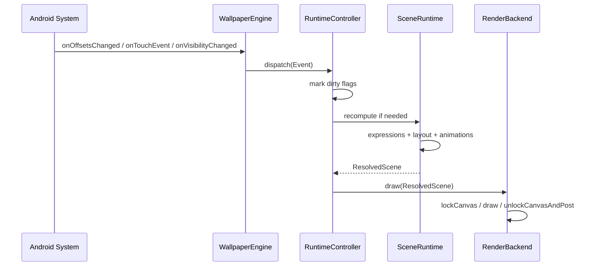
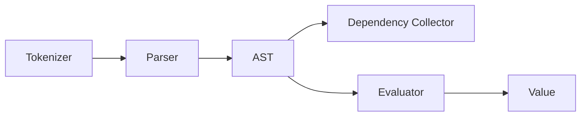
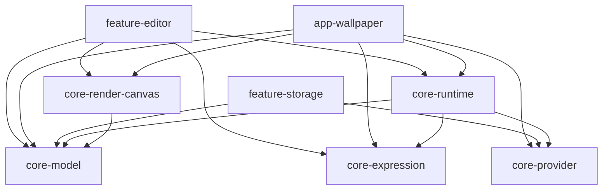
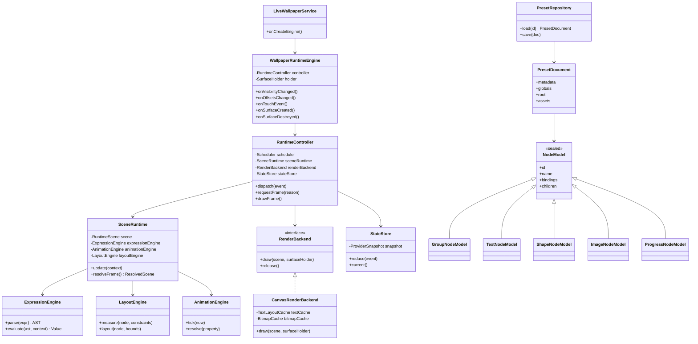

# Android 原生从 0 实现简化版 KLWP 技术设计文档

## 1. 目标与边界

本文档给出一个 `Android 原生 / Kotlin` 的简化版 `KLWP (Kustom Live Wallpaper)` 设计方案，目标是做出一个可运行、可编辑、可导入导出的壁纸运行时，而不是一次性复刻 KLWP 的全部生态。

需要明确的是：

- `KLWP` 本身是闭源应用，下面的产品能力判断基于 `Kustom 官方文档`、`Android 官方 API` 和 `可观察行为`
- 文档里的 `实现架构` 是“合理且可落地”的工程方案，不是对 KLWP 私有源码的逐行还原
- 本方案优先选择 `Canvas-first 的 2D 壁纸引擎`，同时为后续 `OpenGL / AGSL / GPU 特效` 留扩展点

### 1.1 V1 范围

V1 只实现一个“能用”的简化版 KLWP：

- 动态壁纸运行时
- JSON 预设格式
- 场景树：`Root / Group / Text / Shape / Image / Progress`
- 全局变量 `Globals`
- 公式引擎：数学、字符串、条件、日期时间、系统状态
- 简单动画：滚动、透明度、位移、缩放、旋转
- 点击动作：打开 App、改变量、切换可见性
- 基础编辑器：图层树、属性面板、预览
- 预设导入导出

### 1.2 V2/V3 预留

以下能力只做架构预留：

- `Komponent` 组件市场
- `Flow` 自动化编排
- 天气/通知/音乐等复杂 Provider
- Shell 执行与广播桥接
- 复杂滤镜、模糊、3D、粒子
- 多进程远程 Provider 和生态 API

## 2. 资料与项目分析

### 2.1 Android 官方能力边界

动态壁纸的宿主是 `WallpaperService.Engine`，系统会把下面这些核心信号交给壁纸引擎：

- `onVisibilityChanged()`：壁纸是否可见
- `onOffsetsChanged()`：桌面左右滑动偏移
- `onTouchEvent()`：触摸事件
- `onZoomChanged()`：系统级缩放变化
- `onComputeColors()`：向系统报告壁纸主色
- 通过 `SurfaceHolder` 获取绘制目标并提交帧

这意味着简化版 KLWP 的基础现实约束不是“做一个普通 Activity”，而是：

- 绘制必须围绕 `SurfaceHolder`
- 事件来源以 `offset/touch/visibility/zoom` 为主
- 壁纸不掌控 Launcher，很多行为受不同桌面实现差异影响
- 颜色提取和系统主题适配需要接入 `WallpaperColors`

### 2.2 Kustom 官方文档透露出的产品模型

从 Kustom 文档能确认 KLWP 不是单一渲染器，而是一个组合系统：

- 有 `Groups`，且明确区分 `Overlap / Stack / Komponent`
- 有覆盖广泛的 `Functions` 和 `Globals`
- 有动画模型和 `Complex Animation`
- 有 `Flows` 自动化系统
- 官方性能建议强调 `root` 复杂对象数量、对象更新频率和不必要刷新

这些点共同说明 KLWP 的核心不是“壁纸素材切换”，而是：

1. 一个声明式场景树
2. 一个公式求值引擎
3. 一个按事件驱动的刷新调度器
4. 一个编辑器与运行时共享的数据模型

### 2.3 可借鉴的开源项目

#### 2.3.1 GLWallpaperService

`GLWallpaperService` 的价值不在功能，而在结构。它把 `GLSurfaceView` 的一套能力移植进 `WallpaperService`：

- `GLEngine` 承接壁纸生命周期
- 独立 `GLThread`
- EGL 上下文、Surface、swap 管理
- `RENDERMODE_WHEN_DIRTY / CONTINUOUSLY`
- `queueEvent()` 把任务切到 GL 线程

对我们的启发：

- 壁纸引擎需要独立渲染线程
- 主线程接系统事件，渲染线程做资源更新和绘制
- `按需渲染` 比“常驻高帧率”更适合动态壁纸

#### 2.3.2 Muzei

`Muzei` 是最值得借鉴的现代动态壁纸工程样板之一，虽然它不是 KLWP，但它在“生命周期 + 渲染控制 + 可见性 + 资源加载”上非常成熟：

- `MuzeiWallpaperService` 继承 `GLWallpaperService`
- `RenderController` 负责可见性、配置变化、资源重载和何时真正提交到 renderer
- `MuzeiBlurRenderer` 采用 `RENDERMODE_WHEN_DIRTY`
- 只在动画运行、数据变化或 viewport 变化时 `requestRender()`
- 图片解码、缩放、模糊、交叉淡入都做了显式控制
- 把“当前资源”和“下一个资源”拆成两套 picture set，利于过渡动画

对我们的启发：

- 运行时不要把“数据更新”和“绘制”耦在一起
- 需要一个 `RenderController / RuntimeController`
- 动态壁纸适合 `dirty-driven` 而非全量每帧重算
- 资源加载需要显式做低内存和降采样策略

#### 2.3.3 Doodle Android

`Doodle Android` 代表了另一条很适合“简化版 KLWP”的路线：纯 2D、纯 `Canvas`、强调省电和低复杂度。

- 直接使用 `WallpaperService.Engine`
- 通过 `SurfaceHolder.lockHardwareCanvas()` / `lockCanvas()` 绘制
- 通过 `offset + tilt + zoom + user presence` 更新视图状态
- 手动做节流，不盲目超出屏幕刷新率
- 显式处理 `surface` 可用性、解锁动画、night mode、颜色上报

对我们的启发：

- 如果目标是“文本、形状、图片、简单变换、公式驱动 UI”，`Canvas-first` 是更实用的首发方案
- `Canvas + scene graph + cache` 足够支撑简化版 KLWP
- 壁纸领域里，稳定性和省电经常比“更炫的 GPU 管线”更重要

## 3. 关键设计结论

### 3.1 为什么首版选 Canvas-first

KLWP 的主要对象是：

- 文字
- 图片
- 简单形状
- 渐变
- 进度条
- 裁剪与变换
- 基于变量的属性联动

这类对象的主复杂度不在几何，而在：

- 属性绑定
- 文本布局
- 表达式求值
- 数据源同步
- 局部刷新

所以首版渲染层采用：

- `WallpaperService.Engine + SurfaceHolder`
- API 26+ 优先 `lockHardwareCanvas()`
- 低版本回退 `lockCanvas()`
- `Scene Graph + Layout Pass + Expression Pass + Render Pass`

这样做的收益：

- 更容易支持 `TextLayout`、`Path`、`Bitmap`、`Canvas.saveLayer()`
- 更容易做局部缓存
- 编辑器预览可与运行时共享更多逻辑
- 不用一开始就承担完整 GL shader 管线和纹理管理复杂度

### 3.2 为什么仍然保留 GPU 扩展点

下面这些能力未来更适合 GPU：

- 实时模糊
- 高质量 blend/filter
- 粒子
- 大量图片叠层
- 频繁动画

所以架构上渲染后端做成可替换：

- `CanvasRenderBackend` 作为默认实现
- `GlRenderBackend` 作为未来扩展
- 两者共享同一套 `ResolvedScene`

## 4. 系统总览

### 4.1 模块划分



### 4.2 分层职责

#### 系统接入层

- `WallpaperService.Engine`
- 系统生命周期和回调接入
- `SurfaceHolder` 管理
- `notifyColorsChanged()` 调用

#### 运行时控制层

- `RuntimeController`
- 把系统事件转成统一事件流
- 触发 dirty 标记
- 决定何时重算、何时重绘、何时降频

#### 场景与求值层

- `SceneRuntime`
- 维护场景树运行态
- 管理公式依赖图
- 生成已解析、可渲染的节点快照 `ResolvedScene`

#### 渲染层

- `RenderBackend`
- 执行 layout 后的实际绘制
- 维护文本布局缓存、位图缓存、图层缓存

#### 编辑层

- `EditorActivity/Fragment`
- 图层树、属性面板、变量面板
- 预览时复用同一套求值和渲染逻辑

## 5. 核心运行流程

### 5.1 事件到绘制的数据流



### 5.2 帧调度策略

首版采用四档刷新模式：

- `Idle`：完全静止，无定时器，仅监听系统回调
- `Heartbeat 1Hz`：时间公式存在秒级依赖时，每秒刷新一次
- `Interactive 30fps`：拖动、传感器、滚动中
- `Animation 60fps`：有显式动画或缓动过渡

切换规则：

- 只有存在动画或连续输入时才升到高帧率
- 壁纸不可见时停止主动帧循环
- 可见但静止时只保留低频刷新

## 6. 渲染层详细设计

### 6.1 渲染线程模型

简化版不直接把所有逻辑都堆在主线程，而是采用：

- 主线程
  - 接系统回调
  - 管理生命周期
  - 接收设置变化
- Runtime 线程
  - 公式求值
  - 布局计算
  - 动画推进
  - 生成 `ResolvedScene`
- Render 线程
  - 真正 lock/unlock canvas
  - 绘制 display list
  - 维护 GPU/文字/位图缓存

实现上可以先合并为 `单后台 HandlerThread`，再按瓶颈拆分：

- V1：`Runtime + Render` 同线程，简单稳定
- V2：求值线程与绘制线程分离

### 6.2 渲染对象模型

场景树中的每个节点在运行时会经历三种状态：

1. `Model Node`
   - 持久化 JSON 中的原始节点
2. `Runtime Node`
   - 绑定公式、动画、缓存句柄、dirty flags
3. `Resolved Node`
   - 当前帧最终值，渲染器只消费这一层

这样分层的好处是：

- 编辑器可安全修改 `Model`
- Runtime 只增量计算变化节点
- Render 不关心公式语言和编辑语义

### 6.3 Layout Pass

布局分两类：

- `Absolute / Overlap`
  - 类似 KLWP 的自由定位
- `Stack`
  - 纵向/横向线性布局

每帧流程：

1. 计算父容器可用空间
2. 解析节点尺寸表达式
3. 布局文字、图片、形状
4. 计算 transform origin
5. 生成绝对绘制矩形和 clip 区域

### 6.4 Expression Pass

表达式不应该在绘制时临时求值，而应该在帧前统一求值。

每个属性绑定一个表达式：

- `text`
- `color`
- `x/y`
- `width/height`
- `rotation`
- `alpha`
- `visible`

每次事件进来后：

1. 更新 `EvalContext`
2. 命中依赖图中受影响的表达式
3. 只重算脏表达式
4. 写入 `ResolvedNode`

### 6.5 Animation Pass

支持三类动画：

- `ScrollAnimation`
- `TimeAnimation`
- `StateTransitionAnimation`

统一做法：

- 输入：上帧状态、本帧目标状态、时间戳
- 输出：当前帧插值后的 `ResolvedProperty`

首版动画对象只允许绑定到可插值属性：

- `x/y`
- `scale`
- `rotation`
- `alpha`
- `color`

### 6.6 Render Pass

渲染器按深度优先顺序遍历 `ResolvedScene`：

1. `save()`
2. 应用 transform/clip/alpha/blend
3. 按节点类型绘制
4. 绘制子节点
5. `restore()`

各节点的渲染方式：

- `TextNode`
  - `StaticLayout` 或 `TextLayout`
  - 缓存字体、字号、layout 结果
- `ShapeNode`
  - `Paint + Path/Rect/RoundRect/Oval`
- `ImageNode`
  - `BitmapShader` 或 `drawBitmap`
  - `centerCrop / fitCenter / repeat`
- `ProgressNode`
  - 本质为 Shape 的特殊化
- `GroupNode`
  - 不直接绘制，只管理 clip、transform、children

### 6.7 缓存策略

#### 文字缓存

Key：

- 文本内容
- 字体
- 字号
- 宽度约束
- 行高
- 对齐方式

Value：

- `TextLayoutHandle`

#### 图片缓存

两级缓存：

- `DecodedBitmapCache`
- `ScaledBitmapCache`

Key：

- URI
- 目标尺寸
- 裁剪模式
- 圆角/遮罩参数

#### 图层缓存

对复杂 Group 可选启用离屏缓存：

- 条件：子节点多、内容静态、只发生整体平移/透明度变化
- 实现：录制为 `Bitmap Layer`

### 6.8 Dirty Flag 设计

```text
NONE
DATA
EXPRESSION
LAYOUT
TRANSFORM
CONTENT
ANIMATION
FULL_REDRAW
```

传播规则：

- 文本内容变化：`EXPRESSION -> LAYOUT -> CONTENT`
- 仅 alpha 变化：`ANIMATION -> CONTENT`
- 父容器尺寸变化：向子节点传播 `LAYOUT`
- 资源 URI 变化：`DATA -> CONTENT`

## 7. 公式引擎设计

### 7.1 语法目标

语法不需要照搬 Kustom，但要兼顾“编辑器可写”和“运行时易求值”。

建议采用：

- 文本内嵌模式：`"Battery: ${sys.battery}%"` 
- 纯表达式模式：`if(sys.battery < 20, '#FF3B30', '#FFFFFF')`

### 7.2 语法能力

支持：

- 数字、字符串、布尔、颜色
- 算术运算
- 比较与逻辑
- 条件表达式
- 内建函数
- 变量引用
- 属性链式访问

示例：

```text
screen.width * 0.5
if(time.hour >= 18, colors.night, colors.day)
formatDate(time.now, 'HH:mm')
globals.accent
touch.down ? 1 : 0.6
```

### 7.3 解释器架构



建议首版用 `手写递归下降 parser`：

- 体量小
- 易控制错误信息
- 方便嵌入编辑器自动补全

### 7.4 类型系统

```text
NumberValue
StringValue
BoolValue
ColorValue
DurationValue
ImageRefValue
ListValue
NullValue
```

### 7.5 依赖追踪

每条表达式在 parse 后记录依赖集合，例如：

- `time.minute`
- `globals.theme`
- `sys.battery`
- `scroll.x`

运行时只要某个 `ObservableKey` 更新，就重算依赖它的表达式。

### 7.6 Provider 命名空间

首版建议内建：

- `time.*`
- `screen.*`
- `scroll.*`
- `touch.*`
- `sys.*`
- `globals.*`
- `anim.*`

后续扩展：

- `weather.*`
- `music.*`
- `notify.*`
- `flow.*`

## 8. 数据层与状态管理

### 8.1 持久化格式

预设存储为：

```text
preset/
  preset.json
  assets/
    images/...
    fonts/...
```

`preset.json` 只保存模型态，不保存运行时缓存。

### 8.2 状态分层

- `PresetDocument`
  - 用户保存内容
- `RuntimeState`
  - 当前引擎状态
- `ProviderState`
  - 外部数据快照
- `FrameState`
  - 当前帧中间结果

### 8.3 统一状态源

推荐做一个中心状态仓库：

- `StateStore`
- 接收事件
- 更新状态快照
- 输出 dirty 信息

这样编辑器、预览和正式壁纸运行时可以共用逻辑。

## 9. 模块设计

### 9.1 模块列表

- `app-wallpaper`
  - WallpaperService、Engine、运行时接线
- `core-model`
  - 预设模型、节点定义、序列化
- `core-expression`
  - tokenizer/parser/AST/evaluator
- `core-runtime`
  - SceneRuntime、Scheduler、DirtyGraph、AnimationEngine
- `core-render-canvas`
  - Canvas backend
- `core-provider`
  - time/system/touch/scroll/provider
- `feature-editor`
  - 图层树、属性面板、预览
- `feature-storage`
  - preset 导入导出、asset 管理

### 9.2 模块图



## 10. 关键类图



## 11. 数据结构草案

### 11.1 预设模型

```kotlin
@Serializable
data class PresetDocument(
    val version: Int = 1,
    val metadata: PresetMetadata,
    val globals: List<GlobalVarModel>,
    val root: GroupNodeModel,
    val assets: AssetManifest = AssetManifest()
)

@Serializable
data class PresetMetadata(
    val id: String,
    val name: String,
    val author: String? = null,
    val minEngineVersion: Int = 1,
    val createdAt: Long,
    val updatedAt: Long
)

@Serializable
data class AssetManifest(
    val images: List<ImageAssetRef> = emptyList(),
    val fonts: List<FontAssetRef> = emptyList()
)
```

### 11.2 节点模型

```kotlin
@Serializable
sealed interface NodeModel {
    val id: String
    val name: String
    val visible: ExprBinding<Boolean>
    val alpha: ExprBinding<Float>
    val rotation: ExprBinding<Float>
    val scaleX: ExprBinding<Float>
    val scaleY: ExprBinding<Float>
    val translateX: ExprBinding<Float>
    val translateY: ExprBinding<Float>
    val clipToBounds: Boolean
}

@Serializable
data class GroupNodeModel(
    override val id: String,
    override val name: String,
    val layoutType: LayoutType,
    val width: ExprBinding<Dimen>,
    val height: ExprBinding<Dimen>,
    val padding: ExprBinding<EdgeInsets>,
    val spacing: ExprBinding<Float> = ExprBinding.literal(0f),
    val children: List<NodeModel>,
    override val visible: ExprBinding<Boolean> = ExprBinding.literal(true),
    override val alpha: ExprBinding<Float> = ExprBinding.literal(1f),
    override val rotation: ExprBinding<Float> = ExprBinding.literal(0f),
    override val scaleX: ExprBinding<Float> = ExprBinding.literal(1f),
    override val scaleY: ExprBinding<Float> = ExprBinding.literal(1f),
    override val translateX: ExprBinding<Float> = ExprBinding.literal(0f),
    override val translateY: ExprBinding<Float> = ExprBinding.literal(0f),
    override val clipToBounds: Boolean = false
) : NodeModel

@Serializable
data class TextNodeModel(
    override val id: String,
    override val name: String,
    val text: ExprBinding<String>,
    val textSizeSp: ExprBinding<Float>,
    val color: ExprBinding<ColorValue>,
    val fontFamily: String? = null,
    val fontWeight: Int? = null,
    val maxLines: Int = Int.MAX_VALUE,
    val width: ExprBinding<Dimen>,
    val height: ExprBinding<Dimen>,
    override val visible: ExprBinding<Boolean> = ExprBinding.literal(true),
    override val alpha: ExprBinding<Float> = ExprBinding.literal(1f),
    override val rotation: ExprBinding<Float> = ExprBinding.literal(0f),
    override val scaleX: ExprBinding<Float> = ExprBinding.literal(1f),
    override val scaleY: ExprBinding<Float> = ExprBinding.literal(1f),
    override val translateX: ExprBinding<Float> = ExprBinding.literal(0f),
    override val translateY: ExprBinding<Float> = ExprBinding.literal(0f),
    override val clipToBounds: Boolean = false
) : NodeModel

@Serializable
data class ShapeNodeModel(
    override val id: String,
    override val name: String,
    val shape: ShapeType,
    val width: ExprBinding<Dimen>,
    val height: ExprBinding<Dimen>,
    val fill: ExprBinding<PaintFill>,
    val stroke: ExprBinding<StrokeStyle?>,
    val cornerRadius: ExprBinding<Float> = ExprBinding.literal(0f),
    override val visible: ExprBinding<Boolean> = ExprBinding.literal(true),
    override val alpha: ExprBinding<Float> = ExprBinding.literal(1f),
    override val rotation: ExprBinding<Float> = ExprBinding.literal(0f),
    override val scaleX: ExprBinding<Float> = ExprBinding.literal(1f),
    override val scaleY: ExprBinding<Float> = ExprBinding.literal(1f),
    override val translateX: ExprBinding<Float> = ExprBinding.literal(0f),
    override val translateY: ExprBinding<Float> = ExprBinding.literal(0f),
    override val clipToBounds: Boolean = false
) : NodeModel

@Serializable
data class ImageNodeModel(
    override val id: String,
    override val name: String,
    val source: ExprBinding<ImageSource>,
    val width: ExprBinding<Dimen>,
    val height: ExprBinding<Dimen>,
    val contentScale: ContentScaleMode = ContentScaleMode.FIT_CENTER,
    val tint: ExprBinding<ColorValue?> = ExprBinding.literal(null),
    override val visible: ExprBinding<Boolean> = ExprBinding.literal(true),
    override val alpha: ExprBinding<Float> = ExprBinding.literal(1f),
    override val rotation: ExprBinding<Float> = ExprBinding.literal(0f),
    override val scaleX: ExprBinding<Float> = ExprBinding.literal(1f),
    override val scaleY: ExprBinding<Float> = ExprBinding.literal(1f),
    override val translateX: ExprBinding<Float> = ExprBinding.literal(0f),
    override val translateY: ExprBinding<Float> = ExprBinding.literal(0f),
    override val clipToBounds: Boolean = false
) : NodeModel
```

### 11.3 表达式绑定

```kotlin
@Serializable
data class ExprBinding<T>(
    val mode: BindingMode,
    val raw: String,
    val fallback: T? = null
) {
    companion object {
        fun <T> literal(value: T): ExprBinding<T> =
            ExprBinding(BindingMode.LITERAL, value.toString(), value)
    }
}

enum class BindingMode {
    LITERAL,
    EXPRESSION,
    TEMPLATE_STRING
}
```

### 11.4 运行态节点

```kotlin
data class RuntimeNode(
    val model: NodeModel,
    val compiledBindings: Map<String, CompiledExpression>,
    val dirty: DirtyFlags,
    val children: MutableList<RuntimeNode> = mutableListOf(),
    var cacheHandle: RenderCacheHandle? = null
)

data class ResolvedScene(
    val frameTimeMillis: Long,
    val root: ResolvedNode,
    val wallpaperColorsHint: WallpaperColorsHint?
)

sealed interface ResolvedNode {
    val id: String
    val bounds: RectF
    val alpha: Float
    val visible: Boolean
    val transform: TransformMatrix
    val clip: RectF?
}

data class ResolvedTextNode(
    override val id: String,
    override val bounds: RectF,
    override val alpha: Float,
    override val visible: Boolean,
    override val transform: TransformMatrix,
    override val clip: RectF?,
    val text: String,
    val textStyle: ResolvedTextStyle
) : ResolvedNode
```

### 11.5 Provider 快照

```kotlin
data class ProviderSnapshot(
    val time: TimeSnapshot,
    val screen: ScreenSnapshot,
    val scroll: ScrollSnapshot,
    val touch: TouchSnapshot,
    val system: SystemSnapshot,
    val globals: Map<String, Value>
)

data class ScrollSnapshot(
    val xOffset: Float,
    val yOffset: Float,
    val xStep: Float,
    val yStep: Float,
    val xPixelOffset: Int,
    val yPixelOffset: Int
)
```

## 12. Wallpaper Engine 设计

### 12.1 Engine 职责

`WallpaperRuntimeEngine` 负责：

- 初始化 `RuntimeController`
- 转发系统事件
- 感知 `surface` 生命周期
- 控制可见性与主动帧循环
- 触发 `notifyColorsChanged`

### 12.2 Engine 伪代码

```kotlin
class WallpaperRuntimeEngine : WallpaperService.Engine() {
    private val runtime = RuntimeController(...)

    override fun onCreate(holder: SurfaceHolder) {
        super.onCreate(holder)
        setTouchEventsEnabled(true)
        setOffsetNotificationsEnabled(true)
        runtime.attachSurface(holder)
    }

    override fun onVisibilityChanged(visible: Boolean) {
        runtime.dispatch(Event.VisibilityChanged(visible))
    }

    override fun onOffsetsChanged(
        xOffset: Float,
        yOffset: Float,
        xOffsetStep: Float,
        yOffsetStep: Float,
        xPixelOffset: Int,
        yPixelOffset: Int
    ) {
        runtime.dispatch(
            Event.ScrollChanged(
                xOffset, yOffset, xOffsetStep, yOffsetStep, xPixelOffset, yPixelOffset
            )
        )
    }

    override fun onTouchEvent(event: MotionEvent) {
        runtime.dispatch(Event.Touch(event))
    }

    override fun onSurfaceDestroyed(holder: SurfaceHolder) {
        runtime.detachSurface()
    }
}
```

## 13. 编辑器设计

### 13.1 编辑器目标

首版编辑器不追求完整 KLWP 体验，只做可操作闭环：

- 图层列表
- 节点新增/删除/排序
- 属性编辑
- 表达式输入
- 预览同步
- 变量面板

### 13.2 技术方案

- UI：`Jetpack Compose`
- 文档状态：`ViewModel + immutable state`
- 预览：嵌入 `PreviewRuntime`
- 修改行为：编辑 `PresetDocument`，再同步到 preview runtime

### 13.3 编辑器与运行时的关系

编辑器不直接操作 `ResolvedScene`，只操作 `PresetDocument`。

流程：

1. 用户修改属性
2. 生成新 `PresetDocument`
3. `PresetRepository` 保存草稿
4. `PreviewRuntime` 热更新

## 14. 性能与稳定性设计

### 14.1 性能目标

- 静止待机时几乎不掉电
- 秒级时间更新不超过 1Hz
- 滑屏和显式动画流畅
- 中低端机可稳定运行

### 14.2 关键手段

- 按需渲染，默认 `when dirty`
- 增量求值而非全量重算
- 文字布局缓存
- 图片按目标尺寸解码
- 复杂 Group 可选离屏缓存
- Provider 更新去抖
- 不可见时停动画、停主动帧循环

### 14.3 稳定性处理

- 所有 Surface 调用前检查 `isValid`
- 资源加载失败使用 fallback
- 公式求值错误只影响当前属性，不崩整个 runtime
- 单节点渲染失败写日志并跳过
- 强制区分 `Model` 与 `Runtime`

## 15. 颜色提取与系统集成

简化版需要实现：

- `onComputeColors()`
- 内容变化时 `notifyColorsChanged()`

首版颜色策略：

- 如果预设显式指定主色，则优先使用预设
- 否则从背景主图或根节点采样
- 导出 `primary / secondary / tertiary`

## 16. 开发阶段建议

### 16.1 Phase 1

- 跑通 `WallpaperService.Engine`
- 画一个静态矩形和文本
- 支持 offset 和 touch

### 16.2 Phase 2

- 引入 `PresetDocument`
- 实现场景树和 Canvas renderer
- 支持 `Text/Shape/Image/Group`

### 16.3 Phase 3

- 表达式引擎
- Globals
- 增量 dirty 刷新

### 16.4 Phase 4

- 动画系统
- 点击动作
- 简单编辑器

### 16.5 Phase 5

- 导入导出
- 颜色提取
- 性能优化和图层缓存

## 17. 首版最小任务拆分

1. `app-wallpaper` 跑通最小引擎
2. `core-model` 定义 preset schema
3. `core-render-canvas` 支持 `Text/Shape/Image`
4. `core-expression` 支持 literal 和基础表达式
5. `core-runtime` 完成 dirty graph
6. `feature-editor` 完成图层和属性编辑
7. 加入导入导出和 assets

## 18. 主要风险

### 18.1 Launcher 差异

不同 Launcher 对以下行为支持不一致：

- touch 透传
- offsets 精度
- zoom 回调
- 预览与正式壁纸行为一致性

### 18.2 文本与复杂效果

`Canvas` 足够做首版，但下列能力后续可能逼近上限：

- 大量动态模糊
- 多层实时 blend
- 高频动画

### 18.3 公式引擎膨胀

KLWP 的难点不是 parser，而是函数生态和依赖更新边界。必须控制首版函数集合，避免“功能扩张快于架构稳定”。

## 19. 最终建议

如果目标是“从 0 做出一个可用的简化版 KLWP”，推荐路线是：

- 首版选 `Canvas-first`
- 用 `Scene Graph + Expression Engine + Dirty Scheduler` 作为真正核心
- 把渲染线程和编辑器预览统一在一套 runtime 上
- 先做好 `Text / Shape / Image / Globals / Scroll Animations`
- 把 `Flows / Weather / Music / Shell / Komponent 市场` 放到后续阶段

一句话概括：

> 简化版 KLWP 的本质，不是一个“壁纸播放应用”，而是一个运行在 `WallpaperService` 之上的小型声明式 2D UI 引擎。

## 20. 参考资料

### 官方文档

- Android `WallpaperService.Engine`
  - https://developer.android.com/reference/android/service/wallpaper/WallpaperService.Engine
- Android `SurfaceHolder`
  - https://developer.android.com/reference/android/view/SurfaceHolder
- Kustom 下载与更新记录
  - https://docs.kustom.rocks/docs/downloads/download-klwp/
- Kustom FAQ
  - https://docs.kustom.rocks/docs/faq/faq_klwp/
- Kustom Groups
  - https://docs.kustom.rocks/docs/general_information/groups_explained/
- Kustom Functions
  - https://docs.kustom.rocks/docs/reference/functions/
- Kustom Animations
  - https://docs.kustom.rocks/docs/reference/animations/animations_explained/
- Kustom Flows
  - https://docs.kustom.rocks/docs/reference/flows/
- Kustom Designer Tips
  - https://docs.kustom.rocks/docs/general_information/designer_tips/

### 开源项目

- GLWallpaperService
  - https://github.com/GLWallpaperService/GLWallpaperService
- Muzei
  - https://github.com/muzei/muzei
- Doodle Android
  - https://github.com/patzly/doodle-android
